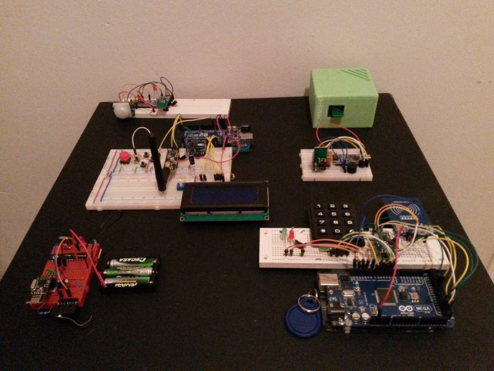

# Arduino Alarm System

A security system for home and small businesses.

It is made up of many wirelessly interconnected modules, each with a particular function:
- Central Node: Connects everything together and has buttons and a screen to change settings.
- Access Node: Allows user to enable/disable the system with a password or RFID token.
- Motion sensor node
- Door/window monitoring node
- Buzzer node

The whole project is done in C++ for the Arduino bootloader.

This was presented as part of my final univerity project.
